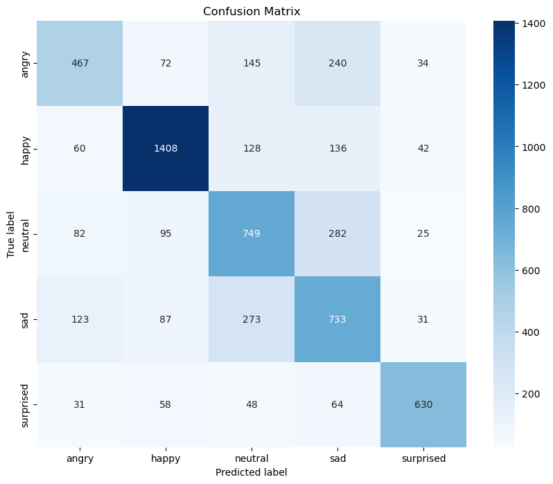

# Real-Time Emotion Detection Using CNN

## Project Overview

This project develops a real-time emotion detection system leveraging a Convolutional Neural Network (CNN). It interprets human emotions from facial expressions captured via webcam, utilizing advanced AI techniques in TensorFlow, OpenCV, and Keras for processing visual data.

*Figure 1: Confusion Matrix - This image shows the confusion matrix of the model predictions versus actual labels, highlighting the model's accuracy and misclassifications.*

)
*Figure 2: Model Architecture - Detailed architecture of the CNN used in the project, showcasing the layers and their configurations.*

## Installation

### Prerequisites
- Python 3.8 or later
- TensorFlow 2.x
- OpenCV
- Matplotlib
- Seaborn
- Pandas
- NumPy

## Setup
To set up the project environment, run the following commands:
`pip install tensorflow opencv-python matplotlib seaborn pandas numpy`

## Dataset
The project utilizes the fer2013 dataset, which includes:
- 24,176 training images
- 6,043 validation images
All images are in grayscale and have a resolution of 48x48 pixels.

## Model Architecture
The CNN model consists of:
- Multiple convolutional layers with ReLU activation to extract features.
- MaxPooling layers to reduce spatial dimensions.
- Dropout layers to prevent overfitting.
- Dense layers for output classification.

## Usage
The model can be trained and evaluated using the provided script. The training process includes data augmentation to enhance model robustness.

### Training the Model
To train the model, execute:
`python Initial_Model_with_5_classes.py`

## Model Evaluation
After training, the model's performance can be evaluated on a test set. This includes generating a confusion matrix and classification report.

## Results
Model performance metrics include accuracy, precision, recall, and F1-scores for each emotion class. A ROC curve analysis is also provided to assess the effectiveness across different thresholds.

## Contributing
Contributions to this project are welcome. Please fork the repository and submit a pull request.
